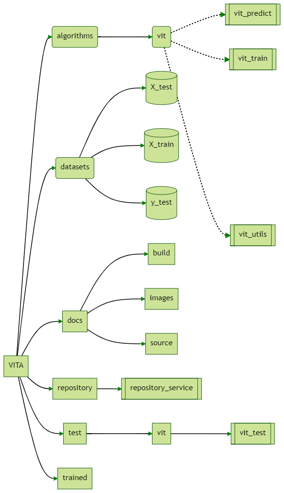
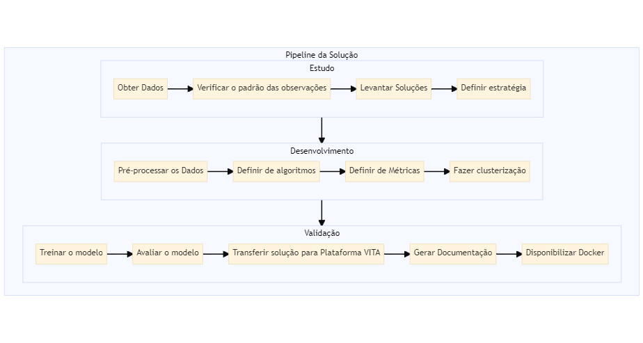

# Desafio SENAI
Projeto VITA

  
  
   

Este projeto foi desenvolvido para apresentar a solução para o desafio proposto pelo Instituto SENAI de Inovação em Sistemas Embarcados.

Este projeto foi desenvolvido no S.O Windows, utilizando programação em Python v 3.8

## Visão Geral

A Plataforma VITA (Virtual Intelligence Training Application) foi desenvolvida para
auxiliar cientistas de dados para análise de dados e integração de algoritmos inteligentes.

VITA tem uma arquitetura base que permite intuitivamente o desenvolvimento modular da aplicação.
É fácil de implementar e por utilizar container Docker é simples a implantação.

Foi desenvolvido um algoritmo para treinar um classificador binário incorporando
o conceito de stacking em sua solução.

A organização desse projeto foi feita através da separação em diretórios:

## Problema

Um dos métodos de ensemble (comitê) mais utilizados em competições é o método de stacking, que consiste no empilhamento de modelos. Nele, as entradas a partir da segunda camada de modelos passam a ser as inferências dos modelos anteriores.

Pede-se nesta prova prática que o candidato treine um classificador binário incorporando o conceito de stacking em sua solução, e que esteja apto a justificar as escolhas que foram feitas ao longo do desenvolvimento.

Para isso é fornecido um dataset para classificação binária com 800 observações para treinamento e 200 observações para teste, contando com 20 features. No entanto, apenas as observações de teste estão rotuladas. Pede-se que o candidato busque estratégias para rotular o conjunto de treinamento.

## Fluxograma da Solução

A Plataforma VITA possui a seguinte estrutura geral de pastas:

## Conteúdo
- Modelos: Random Forest, TreesClassifier e Regressão Logística;
- Normalização: StandardScaler;
- Divisão de subsets treino/testes: K-fold;
- Métricas de avaliação do classificador: Acurácia, Log_loss;
- Bibliotecas no requirements.txt;

## Limitação

O Tempo foi um limitante, a solução desenvolvida foi feita utilizando o Jupyter Notebook.
Não foi possível acabar de migrar o modelo para a Plataforma.

## Contribuição

A Plataforma VITA é fácil e simples de ser compreendida e utilizada, depois de migrado 
a solução para a plataforma, terá uma solução completa e replicável.

##Obs:

O Notebook está na pasta docs, assim como a documentação do Software (HTML e PDF). 
Foi utilizado o software Sphinx para gerar a documentação. 

(https://github.com/nandaguidotti/desafio-senai/docs)

##Referências:

H. Sayadi, N. Patel, S. M. P.D., A. Sasan, S. Rafatirad and H. Homayoun, "Ensemble Learning for Effective Run-Time
Hardware-Based Malware Detection: A Comprehensive Analysis and Classification," 2018 55th ACM/ESDA/IEEE Design
Automation Conference (DAC), 2018, pp. 1-6, doi: 10.1109/DAC.2018.8465828.

Haralabopoulos, Giannis, Ioannis Anagnostopoulos, and Derek McAuley. 2020. "Ensemble Deep Learning for Multilabel
Binary Classification of User-Generated Content" Algorithms 13, no. 4: 83. https://doi.org/10.3390/a13040083

Zeyuan Shang, Emanuel Zgraggen, Benedetto Buratti, Ferdinand Kossmann, Philipp Eichmann, Yeounoh Chung, Carsten Binnig,
Eli Upfal, and Tim Kraska. 2019. Democratizing Data Science through Interactive Curation of ML Pipelines. In Proceedings of the 2019 International Conference on Management of Data (SIGMOD '19). Association for Computing Machinery, New York, NY, USA, 1171–1188. DOI:https://doi.org/10.1145/3299869.3319863

https://docs.docker.com/compose/